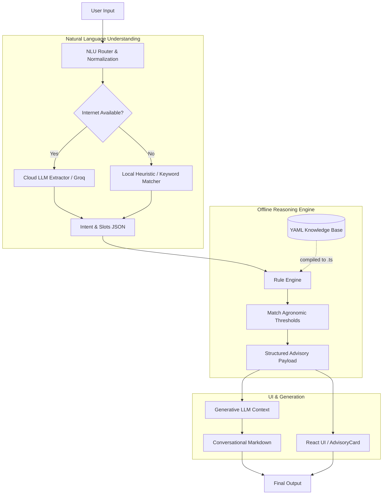

# Holamaatu - Maize Advisory System

Holamaatu is a hybrid, offline-resilient advisory system built for maize farmers in North Karnataka. It processes natural language inputs (in English, Kannada, or Romanized Kannada) and provides highly specific, deterministic agronomic advice based on validated datasets.

## Architecture

The system utilizes a hybrid architecture that leverages the natural language capabilities of a cloud-based LLM while strictly confining agronomic reasoning to a local, deterministic rule engine.



## Core Components

### 1. Data Layer and Knowledge Compilation
Agronomic rules are stored as strict YAML files (e.g., `pest_faw.yaml`, `irrigation.yaml`) in the `knowledge/rulepacks/` directory. These rulepacks define exact thresholds for soil moisture depletion, pest infestation levels, and fertilizer doses. 

To ensure the application can run in the browser without filesystem dependencies, the `scripts/build-kb.ts` script validates these YAML files against strict Zod schemas and compiles them into a static `knowledge_compiled.ts` object.

### 2. Natural Language Understanding (NLU)
The system receives raw text or voice transcripts (via the Web Speech API) and routes it to the NLU module.
*   **Primary Extraction:** The query is sent to the Groq API, which is prompted strictly to return a JSON payload containing the user's intent (e.g., `irrigation_advice`, `pest_management`) and extracted slots (e.g., crop stage, location, pest name).
*   **Offline Fallback:** If the network request fails, the NLU degrades to a local heuristic matcher to guarantee continuous operation for critical offline usage.

### 3. Reasoning Engine
The classified intent and extracted features are passed into the `RuleEngine`. The engine iterates over the compiled datasets to locate the appropriate rule. The output is never raw text; it is a strict, structured `Advisory` object containing a headline, discrete facts, and citations. This guarantees zero hallucinations regarding chemical doses or field actions.

### 4. Expression and UI
The React frontend (built with Vite) renders the structured advisory using deterministic UI cards styled with plain CSS custom properties. Simultaneously, the structured facts are fed back into the Groq LLM as strict context, allowing the LLM to generate a natural, conversational response that strictly adheres to the rule engine's findings.

## Development Setup

### Prerequisites
*   Node.js v18+
*   npm
*   Groq API Key (for cloud NLU extraction and generative conversational features)

### Installation

1. Clone the repository:
   ```bash
   git clone https://github.com/Varun-N777/Holamaatu.git
   cd Holamaatu
   ```

2. Install dependencies:
   ```bash
   npm install
   ```

3. Configure Environment Variables:
   Create a `.env` file in the root directory and add your Groq API key:
   ```env
   VITE_GROQ_API_KEY=your_api_key_here
   ```

4. Compile Knowledge Base:
   Before running the app, compile the YAML datasets into the static TS object:
   ```bash
   npm run tsx scripts/build-kb.ts
   ```

5. Start the Development Server:
   ```bash
   cd packages/app
   npm run dev
   ```

## Repository Structure

*   `/docs`: Internal validation documentation and implementation notes.
*   `/knowledge`: Raw agronomic datasets, YAML rulepacks, and localized strings.
*   `/packages/core`: The pure TypeScript reasoning engine and offline NLU logic.
*   `/packages/app`: The React Progressive Web App frontend.
*   `/schemas`: Zod schemas generated for dataset validation.
*   `/scripts`: Build scripts for knowledge compilation.

## License

This project relies entirely on open-source, zero-cost dependencies. See the `/docs/LICENSES.md` file for dataset citations.
